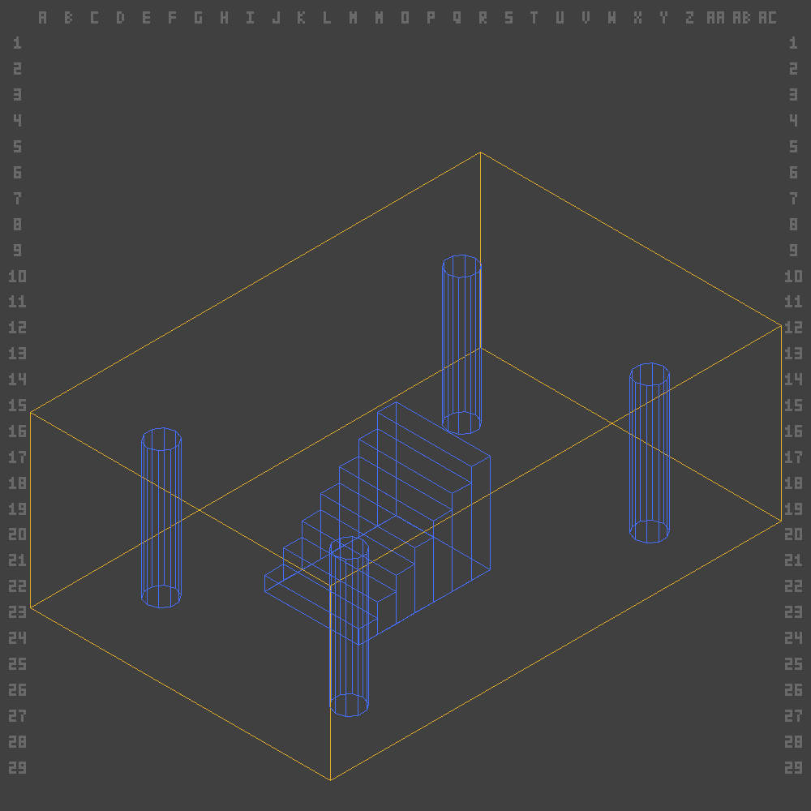
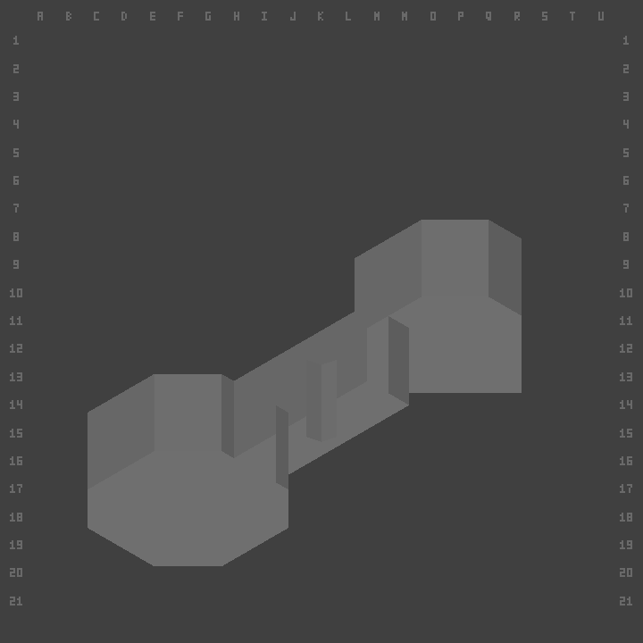

# uedcli


**uedcli reimplements UnrealEd's level-editing capability as a CLI for agents.** Query, author,
build and render classic Unreal Engine 1 levels — Deus Ex to start — through composable text
commands. No GUI, and no editor in the loop: brush geometry, CSG, T3D authoring, map decoding
and rendering all run natively, in-process. The git-tracked T3D model (Unreal's text scene
format) is the source of truth; the `.dx`/`.unr` map is a build artifact.

> **Pre-alpha — expect breaking changes.** Published to get it out there, not because it's
> stable: verbs, flags and output change without notice. It's **mostly AI-built**, and some
> docs are still being cleaned up. No support.



*A subtracted room (gold) with additive pillars and a staircase (blue), built by piping
`brush build` generators into `actor diagram` and rendered offline — no editor open.*

## What it is

UnrealEd is a crash-prone, GUI-only, largely undocumented editor from 1998. Rather than drive
it, uedcli **reimplements what it does** — brush geometry and CSG, T3D level authoring, decoding
compiled maps, offline rendering — as small **verbs that pipe together** (`find` → `clip` →
`replace`). Reads and edits are native compute against the T3D files in git; the editor is never
in the read/edit loop. The one step still delegated to the original editor is the final
`level materialize` build (BSP + lighting bake) — and that's being brought native too. Because
it's all text, an LLM can drive it end to end.

## See it work

**Build geometry from stateless generators and render it — no game files, no editor:**

```bash
uedcli brush build cube --width 768 --breadth 512 --height 288 --csg subtract --base-name Room \
  | uedcli actor diagram --from-t3d - --view iso --out room.png
```

The `brush build` verbs — `cube`, `cylinder`, `cone`, `sheet`, `staircase`, `spiral`,
`extrude`, `revolve` — print T3D to stdout; `actor diagram` renders any T3D, as a labeled
wireframe or a CSG-solved view textured from your project's textures (both offline, no editor):



**Verbs compose over stdin.** Query verbs print one name per line; mutating verbs read that set
from `-`. Clip a placed brush in place with show → clip → replace:

```bash
uedcli actor find --exact-class Brush \
  | uedcli actor diagram -                       # render the set

uedcli actor show Brush41 \
  | uedcli brush clip - --axis z --offset 128 --keep below \
  | uedcli brush replace Brush41 -               # cut it, put it back
```

**Render lit, in-game frames** by booting the real engine headless (`level photo --game`), or a
fast offline draft (`level photo --native`). See
[`docs/reference/level/photo.md`](docs/reference/level/photo.md).

## Quickstart

uedcli is a Python **3.12** CLI plus a small Rust core (the CSG/geometry engine), with one
Python dependency (`Pillow`). The `bin/uedcli` launcher builds both into a local venv on first
run (the Rust build uses Docker; `UEDCLI_SKIP_NATIVE=1` skips it, disabling the native
render/import paths). Releases will ship as standalone binaries.

```bash
export PATH="$PWD/bin:$PATH"     # or symlink bin/uedcli into ~/.local/bin/

uedcli --help
bin/test                         # offline unit tests (committed fixtures, no editor)
```

The `brush`/`actor`/`level` verbs above run inside a uedcli project. To create one — plus a
level to edit and lit `--game` renders — you supply your own Deus Ex copy;
`dev/scripts/setup-game-preview.sh` provisions everything (see
[`dev/docs/deusex-assets-setup.md`](dev/docs/deusex-assets-setup.md)).

## Documentation

- [`docs/`](docs/README.md) — user-facing: the CLI reference (`docs/reference/`) and
  task-oriented guides (`docs/usage/`).
- [`dev/docs/architecture.md`](dev/docs/architecture.md) — layers, the write pattern,
  invariants, the T3D trunk, how to add a verb.
- [`dev/docs/unrealed/`](dev/docs/unrealed/README.md) — the verified UnrealEd-2-under-wine
  knowledge base (exec verbs, quirks, rendering). Public docs on the engine are almost
  nonexistent.
- [`dev/docs/board/`](dev/docs/board/README.md) — the roadmap, as a stage-queue of work items.

## Project status

Targets one engine (UE1) and, so far, one game (Deus Ex). Coverage is uneven; use it to
explore, not to depend on. Issues and ideas welcome.
