# uedcli


**Build, edit and render Unreal Engine 1 game levels from the command line — drivable end to end
by an AI agent.** uedcli reimplements UnrealEd (the Unreal 1 editor) as text: brush geometry, CSG,
and rendering run natively, in-process. The git-tracked T3D model (Unreal's text scene format) is
the source of truth; the compiled `.dx`/`.unr` map is a build artifact. Deus Ex is the first
supported game.

> **Pre-alpha — expect breaking changes.** Published to get it out there, not because it's
> stable: commands, flags and output change without notice. It's **mostly AI-built**, and some
> docs are still being cleaned up. No support.



- **Author geometry as text** — parametric `brush build` generators (`cube`, `staircase`, `spiral`, `revolve`, …) emit T3D you can pipe anywhere.
- **Query & edit by name** — `find` / `show` / `clip` / `replace` compose over stdin (pipe one command's output into the next).
- **Decode retail maps** — `level import` turns a compiled `.dx`/`.unr` into a queryable, diffable T3D tree, natively.
- **Render offline** — labeled wireframes and CSG-solved textured views, without the editor.
- **Native build (in progress)** — `level materialize` compiles the trunk to a playable map (BSP + lighting); that step currently depends on the editor, with ongoing work to remove the dependency entirely.
- **Git-native** — levels are per-actor T3D files that diff and merge like code.

## What it is

uedcli exposes UnrealEd's level-editing as text an agent can drive: every read and edit is native
compute against per-actor T3D files in git, without the editor. The one step that still depends on
the editor is the final `level materialize` build (BSP + lighting); ongoing work will remove that
dependency entirely.

## See it work

**Build geometry from stateless generators and render it:**

```bash
uedcli brush build cube --width 768 --breadth 512 --height 288 --csg subtract --base-name Room \
  | uedcli actor diagram --from-t3d - --view iso --out room.png
```

The `brush build` commands — `cube`, `cylinder`, `cone`, `sheet`, `staircase`, `spiral`,
`extrude`, `revolve` — print T3D to stdout; `actor diagram` renders any T3D, as a labeled
wireframe or, with the project's textures, a CSG-solved textured view.

**Commands compose over stdin.** Query commands print one name per line; mutating commands read
that set from `-`. Clip a placed brush in place with show → clip → replace:

```bash
uedcli actor find --exact-class Brush \
  | uedcli actor diagram -                       # render the set

uedcli actor show Brush41 \
  | uedcli brush clip - --axis z --offset 128 --keep below \
  | uedcli brush replace Brush41 -               # cut it, put it back
```

**Render lit, in-game frames** by booting the real engine headless (`level photo --game`), or a
fast offline draft (`level photo --native`). See
[`docs/reference/level/photo.md`](docs/reference/level/photo.md).

## Quickstart

uedcli is a Python **3.12** CLI plus a small Rust core (the CSG/geometry engine), with one
Python dependency (`Pillow`). The `bin/uedcli` launcher builds both into a local venv on first
run (the Rust build uses Docker; `UEDCLI_SKIP_NATIVE=1` skips it, disabling the native
render/import paths). Releases will ship as standalone binaries.

```bash
export PATH="$PWD/bin:$PATH"     # or symlink bin/uedcli into ~/.local/bin/

uedcli --help
bin/test                         # offline unit tests (committed fixtures, no editor)
```

The `brush`/`actor`/`level` commands above run inside a uedcli project. To create one — plus a
level to edit and lit `--game` renders — you supply your own Deus Ex copy;
`dev/scripts/setup-game-preview.sh` provisions everything (see
[`dev/docs/deusex-assets-setup.md`](dev/docs/deusex-assets-setup.md)).

## Documentation

- [`docs/`](docs/README.md) — user-facing: the CLI reference (`docs/reference/`) and
  task-oriented guides (`docs/usage/`).
- [`dev/docs/architecture.md`](dev/docs/architecture.md) — layers, the write pattern,
  invariants, the T3D trunk, how to add a command.
- [`dev/docs/unrealed/`](dev/docs/unrealed/README.md) — the verified UnrealEd knowledge base
  (console commands, quirks, rendering). Public docs on the engine are almost nonexistent.
- [`dev/docs/board/`](dev/docs/board/README.md) — the roadmap, as a stage-queue of work items.

## Project status

The project is not yet mature, and keeps changing rapidly.
It is being built with AI, and will require a thorough polish pass once all of the planned core functionality is built.

## License

MIT — see [LICENSE](LICENSE).
